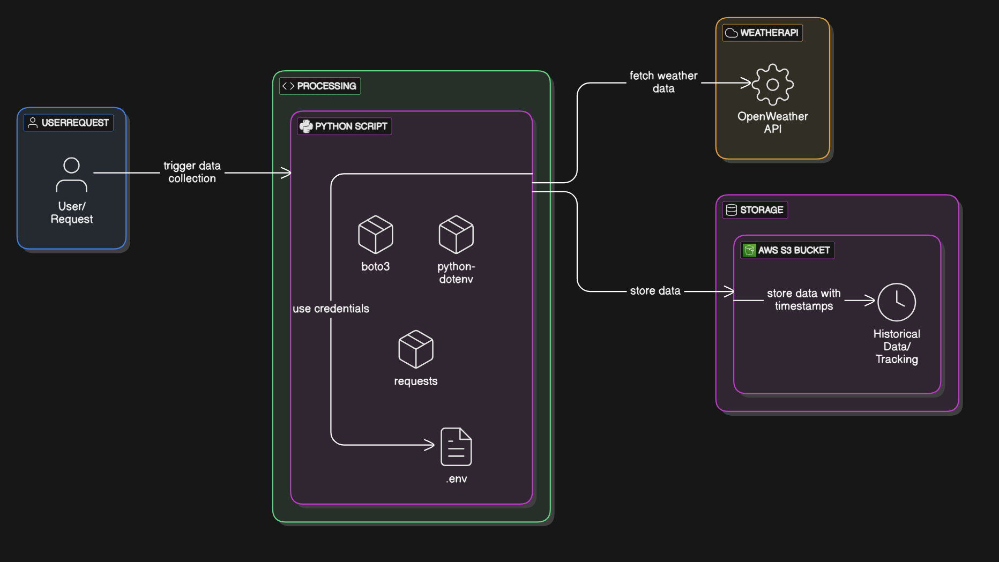
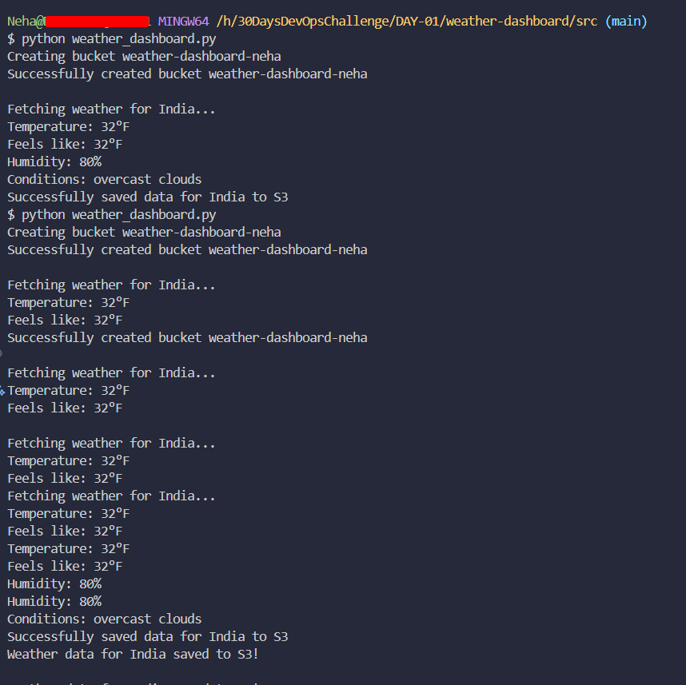
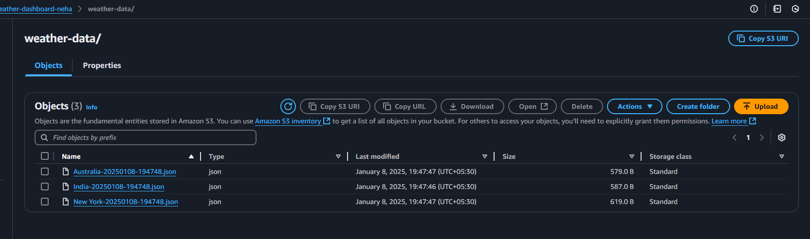

# 🚀 Day 1 - 30 Day DevOps Challenge by #CozyCloud 🌥️



## 🌦️ Weather Dashboard

This application fetches weather data 🌡️ from the OpenWeather API 🌍 and saves it to an AWS S3 Bucket 🪣. The application is containerized using Docker 🐳 for seamless deployment.

---

## 🛠️ Prerequisites

- 🐍 **Python** installed on the system  
- 🖥️ **VS Code** or your favorite code editor  
- ☁️ **AWS Account** with access keys  
- 🔑 **OpenWeather API Key**  

---

## ⚙️ Setup

1. **Clone this repository**:  
   ```bash
   git clone https://github.com/Mygithubneha/30DaysDevOpsChallenge.git
   cd weather-dashboard
   ```

2. **Create a `.env` file** in the root directory with the following content:  
   ```properties
   OPENWEATHER_API_KEY=your_openweather_api_key
   AWS_BUCKET_NAME=weather-dashboard-${RANDOM}
   # AWS CREDENTIALS
   AWS_ACCESS_KEY_ID=your_aws_access_key_id
   AWS_SECRET_ACCESS_KEY=your_aws_secret_access_key
   AWS_DEFAULT_REGION=your_aws_default_region
   ```

---

## 📋 Usage

The application will fetch weather data ☁️🌡️ from the cities listed in the **`/data/cities.json`** file. The weather data will then be saved to the specified AWS S3 bucket 🪣.

---

## ☁️ AWS Configuration

The application uses the **AWS CLI** 📟 to interact with S3. Ensure your AWS credentials are correctly set in the **`.env`** file.

---

## 📊 Outputs

To run the application, execute the following command:  
```bash
python3 src/weather-dashboard.py
```

Sample outputs:  
  
  

---

## 📚 Resources

- 🌍 [OpenWeather API Documentation](https://openweathermap.org/api): Learn more about the OpenWeather API.  
- 🪣 [AWS S3 Documentation](https://docs.aws.amazon.com/s3/index.html): Comprehensive guide to using AWS S3.  
- 📟 [AWS CLI Configuration](https://docs.aws.amazon.com/cli/latest/userguide/cli-configure-files.html): Guide to configuring the AWS CLI.

---

## 📜 License

This project is licensed under the **MIT License**.  

Special thanks to [ShaeInTheCloud](https://github.com/ShaeInTheCloud) 🙌  

